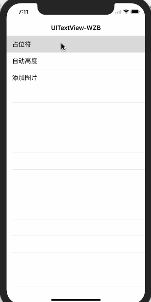
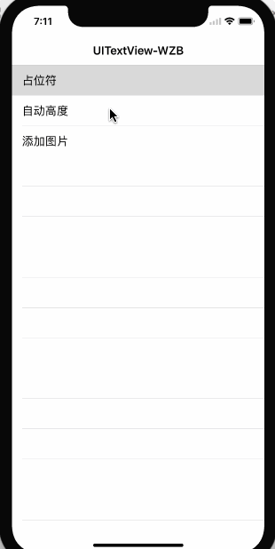
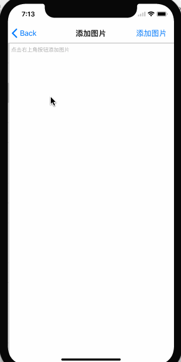

# UITextView-WZB

[中文文档](./README.zh-CN.md)

A modern Swift `UITextView` component with three things most apps end up building anyway:

- Placeholder support
- Auto-growing height
- Inline image attachments

`UITextView-WZB` keeps the API small and UIKit-native while covering the common chat/composer use cases.

## Features

- Built in Swift
- Works with UIKit directly
- Supports Swift Package Manager
- Supports CocoaPods
- Ships with a demo app
- Includes unit tests for the core behaviors

## Preview

### Placeholder



### Auto Height



### Inline Images



## Requirements

- iOS 11.0+
- Swift 5
- Xcode 15+ recommended

## Installation

### Swift Package Manager

Add the package:

```swift
.package(url: "https://github.com/WZBbiao/UITextView-WZB.git", from: "2.0.1")
```

Then add the `WZBTextView` product to your target dependencies.

### CocoaPods

```ruby
pod "UITextView-WZB", "~> 2.0"
```

## Quick Start

```swift
import UIKit
import WZBTextView

final class ComposerViewController: UIViewController {
    private let textView = WZBTextView()
    private var heightConstraint: NSLayoutConstraint?

    override func viewDidLoad() {
        super.viewDidLoad()

        view.backgroundColor = .systemBackground
        textView.translatesAutoresizingMaskIntoConstraints = false
        textView.placeholder = "Write a message..."
        textView.minHeight = 44
        textView.font = .systemFont(ofSize: 17)

        view.addSubview(textView)

        heightConstraint = textView.heightAnchor.constraint(equalToConstant: 44)
        heightConstraint?.isActive = true

        NSLayoutConstraint.activate([
            textView.leadingAnchor.constraint(equalTo: view.leadingAnchor, constant: 16),
            textView.trailingAnchor.constraint(equalTo: view.trailingAnchor, constant: -16),
            textView.bottomAnchor.constraint(equalTo: view.safeAreaLayoutGuide.bottomAnchor, constant: -16)
        ])

        textView.autoHeight(maxHeight: 140) { [weak self] height in
            self?.heightConstraint?.constant = height
        }
    }
}
```

## API

### Properties

```swift
public var placeholder: String
public var placeholderColor: UIColor
public var minHeight: CGFloat
public var maxHeight: CGFloat
public var onHeightChange: ((CGFloat) -> Void)?
```

### Methods

```swift
public func autoHeight(maxHeight: CGFloat, onHeightChange: ((CGFloat) -> Void)? = nil)
public func images() -> [UIImage]
public func addImage(_ image: UIImage)
public func addImage(_ image: UIImage, size: CGSize)
public func insertImage(_ image: UIImage, size: CGSize, index: Int)
public func addImage(_ image: UIImage, multiple: CGFloat)
public func insertImage(_ image: UIImage, multiple: CGFloat, index: Int)
```

## Demo

The demo project includes:

- Placeholder example
- Centered auto-growing text view example
- Inline image insertion example

## Project Structure

```text
Sources/WZBTextView/           Library source
WZBTextView-demo/             Demo app
WZBTextView-demoTests/        Unit tests
```

## Versioning

`2.x` is the Swift rewrite.

If you were using the older Objective-C implementation, treat `2.0.0` as the migration point and `2.0.1` as the first patch release on top of the Swift rewrite.

## License

`UITextView-WZB` is available under the MIT license. See the [LICENSE](./LICENSE) file for details.
